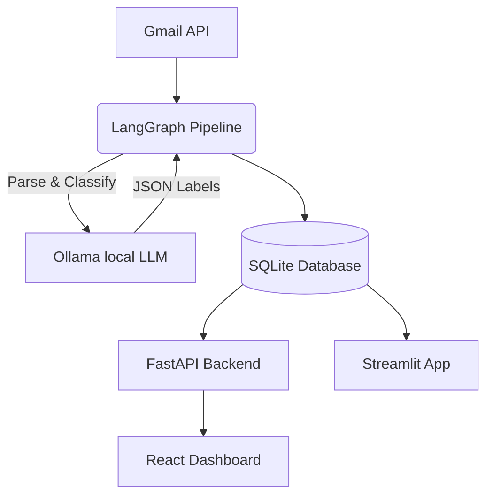

# Inbox Intel 🧠✉️

A local, privacy-first Gmail categorisation dashboard powered by **LangGraph**, **Ollama**, and **React**.

Inbox Intel connects to your Gmail, fetches unread emails, and uses a local LLM to automatically categorise them by action intent, department, and priority. The entire pipeline runs locally on your machine, ensuring your email data never leaves your device (except for the initial Google API fetch).

## 🚀 Features

- **Privacy-First**: All AI classification happens completely locally via Ollama (`phi3:mini`).
- **Automated Categorisation**: Uses LangGraph to orchestrate fetching, parsing, and classifying emails into useful tags.
- **Modern React Dashboard**: A beautiful, real-time dashboard built with React, Vite, Tailwind CSS, and Recharts.
- **FastAPI Backend**: A lightweight backend that serves email data from a local SQLite database to the frontend.
- **Classic Streamlit App**: A legacy dashboard is also available out-of-the-box.

---

## 🏗️ Architecture



### Classification Labels

| Group | Labels |
|-------|--------|
| **Action Intent** | `ACTION_REQUIRED`, `AWAITING_REPLY`, `FYI`, `REFERENCE` |
| **Department** | `HR_ADMIN`, `INTERNAL_PROJECT`, `EXTERNAL_CLIENT`, `IT_SYSTEMS`, `FINANCE` |
| **Priority** | `URGENT`, `STANDARD`, `LOW_PRIORITY` |

---

## 🛠️ Quick Start

### Prerequisites
- **Python 3.11+**
- **Node.js** (for the React Dashboard)
- **[Ollama](https://ollama.com)** installed and running (`ollama serve`)
- A **Google Cloud project** with the Gmail API enabled and OAuth credentials downloaded.

### 1. Clone & Setup Python Backend
```bash
git clone https://github.com/sagar-69/Email-Categoriser.git
cd Email-Categoriser

# Run the setup script to create venv, install deps, and pull the Ollama model
bash scripts/setup.sh
```

### 2. Setup React Dashboard
```bash
cd react-dashboard
npm install
cd ..
```

### 3. Configure Google OAuth
1. Copy the example environment file:
   ```bash
   cp .env.example .env
   ```
2. Edit `.env` with your Google OAuth `CLIENT_ID` and `CLIENT_SECRET`.
3. Place your downloaded `credentials.json` in `~/.inbox-intel/`.

### 4. Run Everything
We provide a convenient bash script that uses AppleScript to open three terminal windows to run **Ollama**, the **FastAPI server**, and the **React Dashboard** simultaneously:

```bash
bash start.sh
```

> **Note:** The first time the backend runs, it will open your browser for Google OAuth consent. After authorising, it will fetch and classify your emails.

Alternatively, you can run the older Streamlit dashboard instead of the React dashboard:
```bash
source venv/bin/activate
python scripts/run.py
```

---

## 💻 CLI Commands

You can run individual parts of the application using the CLI:

| Command | Effect |
|---------|--------|
| `bash start.sh` | Starts Ollama, FastAPI, and React Dashboard |
| `python scripts/run.py` | Run LangGraph classification + open Streamlit |
| `python scripts/run.py --fetch-only` | Run classification in background |
| `streamlit run dashboard/app.py` | Open Streamlit dashboard only |
| `cd react-dashboard && npm run dev` | Run React dashboard dev server |
| `pytest tests/` | Run unit tests |

---

## 📂 Project Structure

```text
inbox-intel/
├── api/                        # FastAPI REST Server
│   └── server.py
├── auth/                       # OAuth2 flow for Gmail API
├── config/                     # Central config and enums
├── dashboard/                  # Legacy Streamlit App
├── data/                       # SQLite helpers & Fetcher
├── pipeline/                   # LangGraph Orchestration
│   ├── graph.py                # Graph assembly
│   ├── nodes.py                # Node functions
│   └── prompts.py              # LLM prompts
├── react-dashboard/            # Modern Frontend (Vite + React)
│   ├── src/
│   └── package.json
├── scripts/
│   ├── setup.sh                # Initial setup
│   └── run.py                  # CLI runner
├── tests/                      # Unit tests
└── start.sh                    # Multi-service launcher script
```

---

## 🔒 Privacy Guarantee

- **Local AI Inference**: All LLM processing runs entirely locally on your machine via Ollama on port `11434`.
- **Zero Data Sharing**: Your email contents are **never** sent to OpenAI, Anthropic, or any third-party external APIs.
- **Secure Credentials**: Credentials and tokens are stored securely outside the repo in `~/.inbox-intel/`.
- **Local DB**: All processed data remains in a local SQLite file.

## 📄 License
MIT License
