<div align="center">

<!-- PROJECT LOGO / BANNER -->
<br/>

```
██╗███╗   ██╗██████╗  ██████╗ ██╗  ██╗    ██╗███╗   ██╗████████╗███████╗██╗
██║████╗  ██║██╔══██╗██╔═══██╗╚██╗██╔╝    ██║████╗  ██║╚══██╔══╝██╔════╝██║
██║██╔██╗ ██║██████╔╝██║   ██║ ╚███╔╝     ██║██╔██╗ ██║   ██║   █████╗  ██║
██║██║╚██╗██║██╔══██╗██║   ██║ ██╔██╗     ██║██║╚██╗██║   ██║   ██╔══╝  ██║
     ██║██║ ╚████║██████╔╝╚██████╔╝██╔╝ ██╗    ██║██║ ╚████║   ██║   ███████╗███████╗
     ╚═╝╚═╝  ╚═══╝╚═════╝  ╚═════╝ ╚═╝  ╚═╝    ╚═╝╚═╝  ╚═══╝   ╚═╝   ╚══════╝╚══════╝
```

### 🧠✉️ **Privacy-First, Local AI Email Intelligence**
#### *Your emails. Your AI. Your machine. Zero data leaves your device.*

<br/>

[](https://www.python.org/downloads/)
[](https://fastapi.tiangolo.com/)
[](https://react.dev/)
[](https://github.com/langchain-ai/langgraph)
[](https://ollama.com/)

[](https://opensource.org/licenses/MIT)
[](https://sqlite.org/)
[](https://tailwindcss.com/)
[](https://vitejs.dev/)
[](https://github.com/sagar-69/Email-Categoriser)

<br/>

[🚀 Quick Start](#-quick-start) • [✨ Features](#-key-features) • [🏗️ Architecture](#️-system-architecture) • [📡 API Docs](#-api-documentation) • [🤝 Contributing](#-contributing)

</div>

---

## 📸 Project Banner

<div align="center">

| Dashboard (Dark Mode) | Dashboard (Light Mode) |
|:---:|:---:|
| 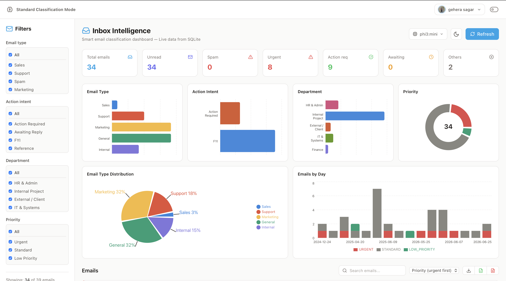 | 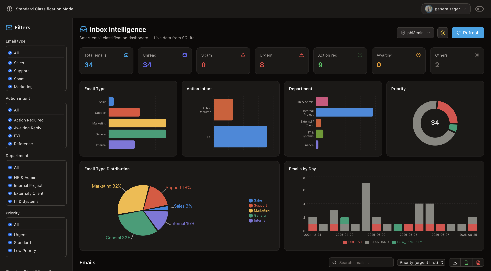 |

| Email Classification View | HR Mode Analytics |
|:---:|:---:|
| 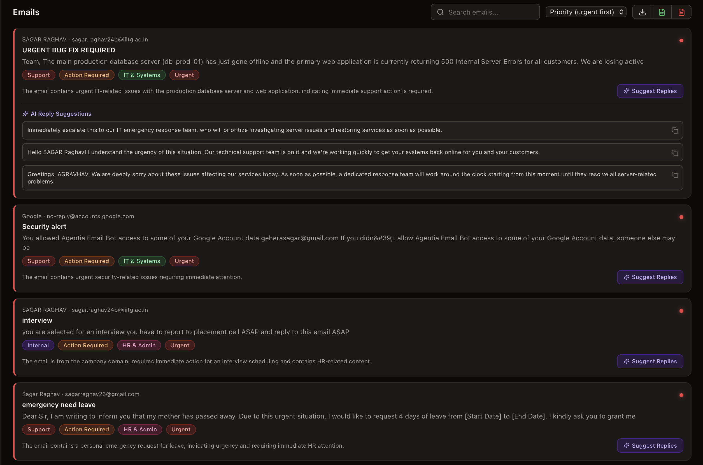 | 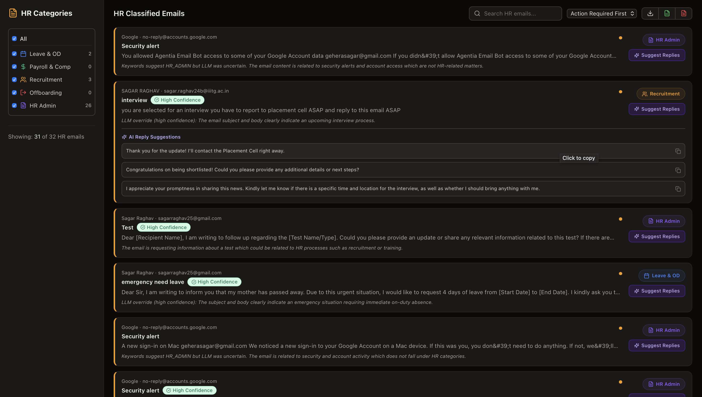 |

</div>

---

## 📖 Overview

### The Problem

Professional inboxes are overwhelmed. The average knowledge worker receives **120+ emails per day** — sales pitches, support tickets, HR notices, spam, and urgent action items all flood in together. Manual triage wastes hours and critical emails get buried.

Existing AI solutions (Gmail Smart Labels, Superhuman, Shortwave) solve this by **sending your emails to cloud AI services** — a serious privacy concern for business, legal, and personal communications.

### The Solution

**Inbox Intel** connects to your Gmail via OAuth2, fetches unread emails, and runs a local Large Language Model (via Ollama) to automatically classify every email across **4 intelligent dimensions** — all without a single byte of your email content ever leaving your machine.

### Key Objectives

| Objective | How It's Achieved |
|---|---|
| 🔒 **Absolute Privacy** | All LLM inference via local Ollama — zero cloud API calls |
| 🤖 **Intelligent Classification** | LangGraph + local LLM across 4 label dimensions simultaneously |
| 📊 **Actionable Insights** | Interactive React dashboard with 6 charts, 6 metric cards, multi-filter |
| 🏢 **Domain-Specific Modes** | HR Classification mode with keyword consensus engine |
| ⚡ **Developer-Friendly** | FastAPI backend, CLI runner, Rich terminal output, JWT auth |

### Who Is This For?

- 🧑‍💼 **Professionals** drowning in mixed-priority emails who value their privacy
- 🏢 **HR teams** needing to track leave requests, payroll queries, and recruitment threads
- 🧑‍💻 **Developers** who want a production-quality local AI application to study and extend
- 🔬 **Researchers** exploring privacy-preserving NLP and local LLM workflows

---

## ✨ Key Features

<table>
<tr>
<td width="50%">

### 🔒 Privacy First
- **100% local AI inference** — No email data leaves your machine
- **Read-only Gmail scope** (`gmail.readonly`) — Cannot send, delete, or modify
- **Local SQLite database** — All classified data stored on-device
- **Credentials outside repo** — OAuth tokens stored in `~/.inbox-intel/`

</td>
<td width="50%">

### 🤖 4-Dimensional AI Classification
- Simultaneously labels each email across **4 independent dimensions**
- LangGraph pipeline with **retry logic** (up to 3 attempts per email)
- **Fallback labels** guarantee every email gets stored, even on LLM failure
- Configurable LLM (swap `phi3:mini` → `llama3` with one `.env` change)

</td>
</tr>
<tr>
<td width="50%">

### 🏢 HR Classification Mode
- Dedicated **HR consensus engine** (keyword pre-filter + LLM)
- Five HR categories: Leave & OD, Payroll & Comp, Recruitment, Offboarding, HR Admin
- **Keyword confidence scores** and matched keyword tracking
- Toggle between Standard and HR modes from the React dashboard

</td>
<td width="50%">

### 📊 Modern React Dashboard
- **Dark/Light mode** toggle with Tailwind CSS
- **6 live metric cards** (Total, Spam, Urgent, Action Required, Awaiting Reply, Failed)
- **6 interactive charts** — bar charts, pie chart, stacked timeline
- **Multi-select sidebar filters** across all 4 label dimensions
- **Real-time search**, CSV/Excel/PDF export, and one-click re-classification

</td>
</tr>
<tr>
<td width="50%">

### ⚡ LangGraph Orchestration & Backend
- State-graph pipeline: `parse_node → classify_node → store_node`
- **Conditional retry edge** loops back on `status == "pending"`
- Built-in **observability** with custom `RequestLoggingMiddleware` (Loguru)
- **Model Switching**: Dynamic model selection via `/api/models` endpoint

</td>
<td width="50%">

### 🛠️ Developer-Friendly CLI & API
- **Auto-Reply AI**: Generate draft replies via `/api/emails/{id}/reply-suggestions`
- **JWT Authentication**: Pure-Python HS256 tokens securing all data endpoints
- **Account-aware API retry**: Automatic JWT refresh on 401 responses
- Auto-generated **OpenAPI docs** at `localhost:8000/docs`

</td>
</tr>
</table>

### Classification Labels at a Glance

| Dimension | Labels |
|---|---|
| 📧 **Email Type** | `SALES` · `SUPPORT` · `SPAM` · `MARKETING` · `GENERAL` · `INTERNAL` |
| ⚡ **Action Intent** | `ACTION_REQUIRED` · `AWAITING_REPLY` · `FYI` · `REFERENCE` |
| 🏢 **Department** | `HR_ADMIN` · `INTERNAL_PROJECT` · `EXTERNAL_CLIENT` · `IT_SYSTEMS` · `FINANCE` |
| 🔥 **Priority** | `URGENT` · `STANDARD` · `LOW_PRIORITY` |
| 🏢 **HR Category** *(HR mode)* | `LEAVE_OD` · `PAYROLL_COMP` · `RECRUITMENT` · `OFFBOARDING` · `HR_ADMIN` |

---

## 🛠️ Tech Stack

### Backend

| Technology | Version | Purpose |
|---|---|---|
| **Python** | 3.11+ | Core runtime |
| **FastAPI** | Latest | REST API server with auto OpenAPI docs |
| **LangGraph** | ≥0.2.16 | LLM pipeline orchestration & state management |
| **LangChain Core** | ≥0.2.27 | LLM abstraction layer |
| **Ollama** | 0.2.1 | Local LLM inference engine (phi3:mini / llama3) |
| **SQLite** + **SQLAlchemy** | 2.0.30 | Local persistence, zero-config database |
| **Pandas** | 2.2.2 | Data aggregation and DataFrame queries |
| **PyJWT** | Latest | HS256 JSON Web Token authentication |
| **Loguru** | 0.7.2 | Structured, beautiful logging |
| **Rich** | 13.7.1 | Terminal progress tables and CLI output |
| **Tenacity** | 8.3.0 | Retry logic for resilient LLM calls |
| **python-dotenv** | 1.0.1 | Environment variable management |

### Frontend

| Technology | Version | Purpose |
|---|---|---|
| **React** | 18 | UI framework |
| **Vite** | Latest | Build tool and HMR dev server |
| **Tailwind CSS** | Latest | Utility-first styling |
| **Recharts** | Latest | Data visualization (bar, pie, stacked charts) |
| **Lucide React** | Latest | Icon library |
| **xlsx** | Latest | Excel export (.xlsx) |
| **jspdf** + **jspdf-autotable** | Latest | PDF export |

### AI & ML

| Technology | Purpose |
|---|---|
| **Ollama** (local) | Runs phi3:mini / llama3 models with GPU/CPU inference |
| **LangGraph** | State-machine orchestration for the classification pipeline |
| **LangChain Community** | Message formatting and LLM client abstraction |
| **Prompt Engineering** | Custom system prompt in `pipeline/prompts.py` as the AI "contract" |
| **Keyword Engine** | Deterministic pre-filter for HR classification confidence scores |

### Authentication & Integrations

| Technology | Purpose |
|---|---|
| **google-auth** 2.29.0 | Google OAuth2 credential management |
| **google-auth-oauthlib** 1.2.0 | OAuth2 browser consent flow |
| **google-api-python-client** 2.127.0 | Gmail API v1 client |

---

## 🏗️ System Architecture

Inbox Intel is a **4-layer local application** with clean separation of concerns:

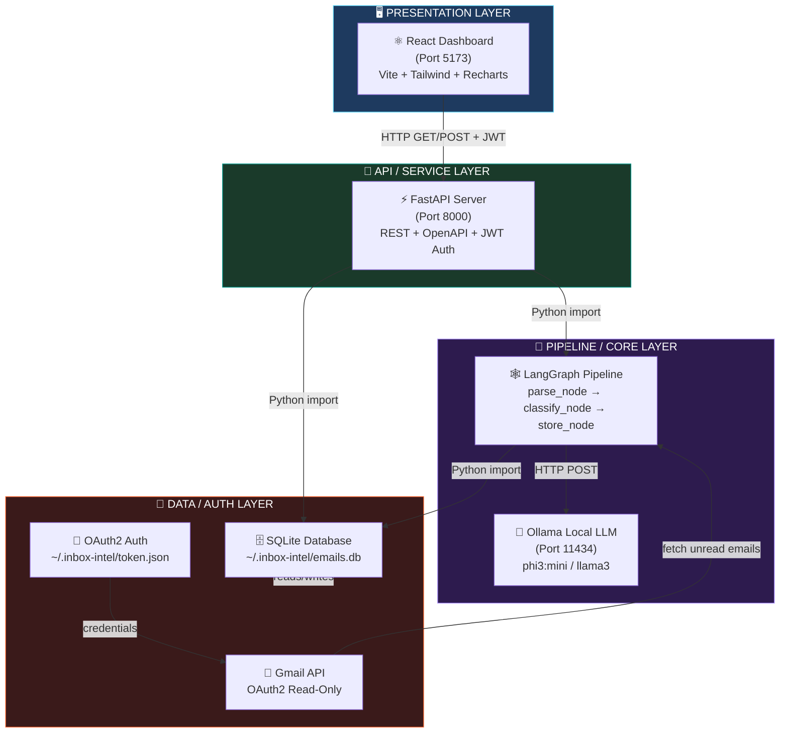

<div align="center">

> 📐 **Architecture Deep Dive** — Full-resolution visual breakdown

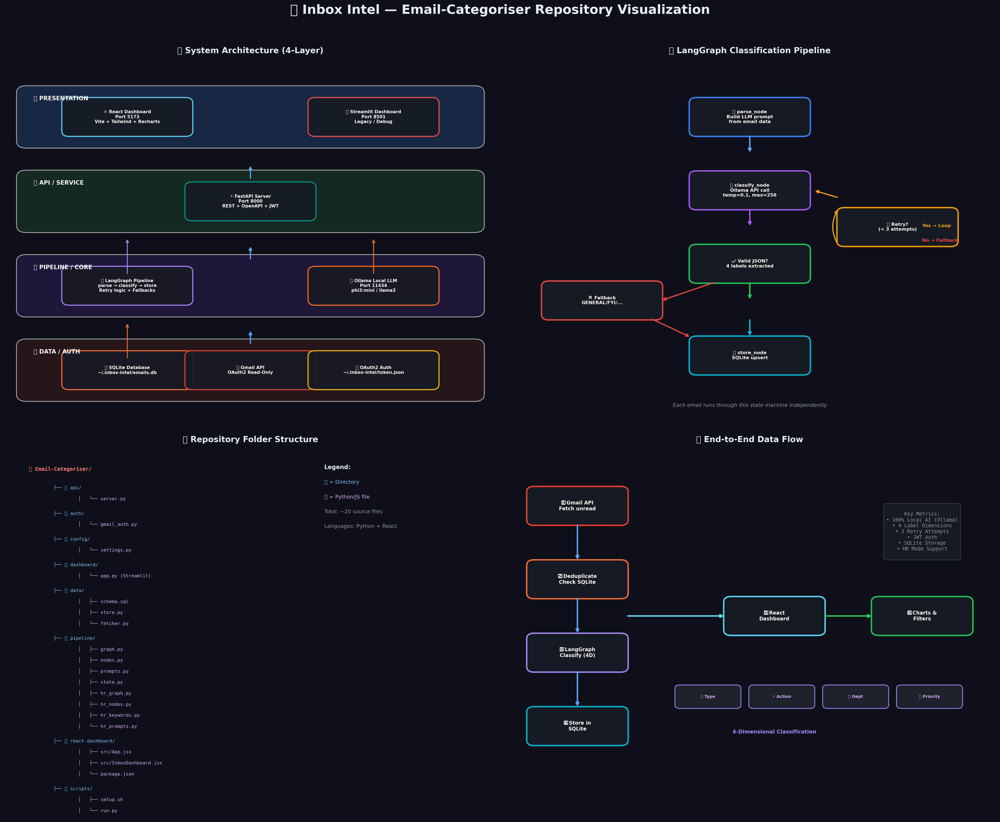

</div>

### Service Port Map

| Service | Port | Description |
|---|---|---|
| ⚛️ React Dashboard | `5173` | Primary user interface (Vite dev server) |
| ⚡ FastAPI Server | `8000` | REST API — `/docs` for interactive API explorer |
| 🦙 Ollama LLM | `11434` | Local inference engine (must be running) |

---

## 🔄 Workflow Diagram

### End-to-End Classification Flow

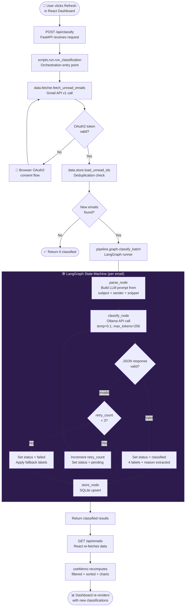

### HR Classification Mode Flow

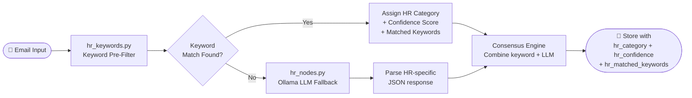

<div align="center">

> 🔬 **Deep Dive Visualization** — Database schema + HR pipeline flow

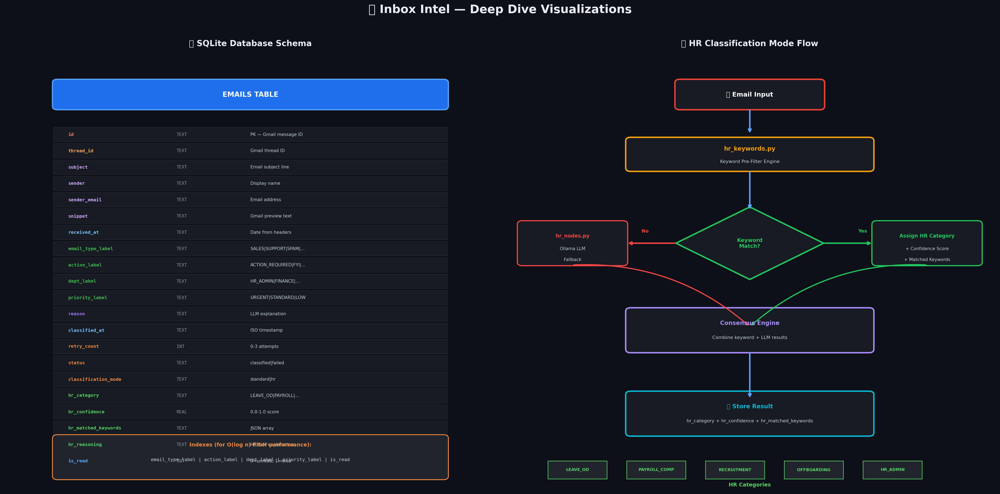

</div>

---

## 🔲 Application Wireframe

> High-level component layout of the React Dashboard

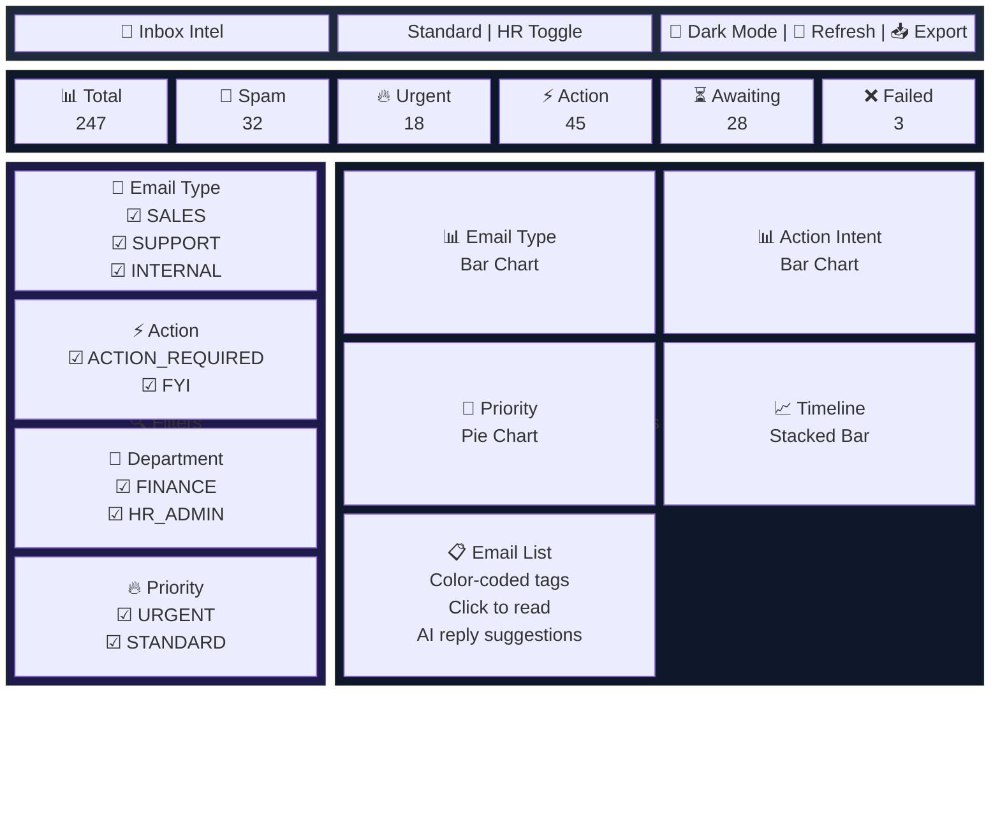

---

## 📋 Project Flow — Step by Step

**Step 1 → Gmail Fetch**
The application authenticates via OAuth2 (`auth/gmail_auth.py`) using a `gmail.readonly` scope. It fetches unread message IDs from the Gmail API, then retrieves subject, sender, snippet, and body preview for each.

**Step 2 → Deduplication**
`data/store.py` loads all existing message IDs from SQLite. Any previously classified email is excluded — the pipeline only processes genuinely new emails.

**Step 3 → LangGraph Pipeline (per email)**
Each new email enters a 3-node LangGraph state machine:
- `parse_node` — Formats a structured prompt with subject, sender, and snippet
- `classify_node` — Sends the prompt to Ollama (temperature 0.1), parses the strict JSON response, validates all 4 labels against Python enums
- `store_node` — Upserts the classified record to SQLite with all labels, the LLM's reasoning, retry count, and timestamp

**Step 4 → Retry / Fallback Logic**
If Ollama returns malformed JSON or invalid labels, the graph loops back to `classify_node` up to 3 times. After 3 failures, fallback labels (`GENERAL`, `FYI`, `INTERNAL_PROJECT`, `STANDARD`) are applied and status is set to `failed`.

**Step 5 → REST API Serves the Dashboard**
FastAPI's `/api/emails` loads all records via `pandas.read_sql_query()` and returns a JSON array. The React dashboard's `useMemo` hooks compute filtered views, sorted lists, and all chart datasets client-side.

**Step 6 → User Interaction**
Users can filter by any combination of email type, action, department, or priority. Clicking an email marks it as read (`PATCH /api/emails/{id}/read`). The HR mode toggle shows a confirmation modal before switching classification modes. AI auto-reply suggestions can be generated for any email.

---

## 📁 Folder Structure

```text
inbox-intel/
│
├── 📁 api/                         # REST API layer
│   ├── server.py                   # FastAPI app — 11 endpoints, CORS, JWT
│   ├── auth_jwt.py                 # JWT token generation & validation
│   ├── middleware.py               # Request logging middleware (Loguru)
│   └── reply.py                    # AI auto-reply suggestion endpoint
│
├── 📁 auth/                        # Authentication layer
│   └── gmail_auth.py               # OAuth2 flow, token persistence, auto-refresh
│
├── 📁 config/                      # Central configuration
│   └── settings.py                 # Paths, Ollama config, 4 Label Enums, color maps
│
├── 📁 data/                        # Data access layer
│   ├── schema.sql                  # SQLite DDL — emails table + 7 indexes
│   ├── store.py                    # CRUD: upsert, load_all, get_stats, mark_as_read
│   └── fetcher.py                  # Gmail API integration, BatchHttpRequest
│
├── 📁 pipeline/                    # AI classification pipeline
│   ├── graph.py                    # LangGraph assembly, compile, classify_batch runner
│   ├── nodes.py                    # 3 node functions: parse, classify, store
│   ├── prompts.py                  # LLM system prompt + user prompt builder
│   ├── state.py                    # EmailState TypedDict (shared pipeline state)
│   ├── hr_graph.py                 # HR-specific LangGraph pipeline
│   ├── hr_nodes.py                 # HR classification node functions
│   ├── hr_keywords.py              # Deterministic keyword matcher + confidence scorer
│   ├── hr_prompts.py               # HR-specific LLM prompts
│   └── reply_prompts.py            # AI auto-reply prompt templates
│
├── 📁 react-dashboard/             # Modern React frontend
│   ├── src/
│   │   ├── App.jsx                 # Root component + Google OAuth login
│   │   ├── InboxDashboard.jsx      # Main dashboard (all hooks + UI)
│   │   ├── HRDashboard.jsx         # HR mode dashboard component
│   │   ├── HREmailCard.jsx         # HR email card with AI replies
│   │   ├── main.jsx                # ReactDOM entry point
│   │   └── index.css               # Tailwind base styles
│   ├── package.json                # Node.js dependencies
│   └── vite.config.js              # Vite + React plugin + API proxy config
│
├── 📁 scripts/                     # CLI & automation
│   ├── setup.sh                    # One-time setup: venv, deps, Ollama pull, DB init
│   ├── generate_certs.sh           # Optional TLS certificate generation
│   └── run.py                      # CLI runner — argparse, Rich output, cron-friendly
│
├── 📁 tests/                       # Test suite (pytest — 68 tests)
│   ├── conftest.py                 # Shared fixtures
│   ├── test_store.py               # Database CRUD tests
│   ├── test_fetcher.py             # Gmail API fetch tests
│   ├── test_graph.py               # LangGraph pipeline tests
│   ├── test_pipeline.py            # End-to-end classification tests
│   └── test_hr_keywords.py         # HR keyword engine tests
│
├── 📁 screenshots/                 # Project screenshots & visualizations
│
├── 📄 .env.example                 # Template — copy to .env and fill credentials
├── 📄 .gitignore                   # Excludes venv/, .env, token.json, *.db
├── 📄 ARCHITECTURE.md              # Deep-dive architecture documentation
├── 📄 FEATURE_LOG.md               # Chronological feature changelog
├── 📄 PROJECT.md                   # Project context & technical details
├── 📄 requirements.txt             # Python dependencies (pinned versions)
├── 📄 start.sh                     # macOS multi-service launcher
├── 📄 start-linux.sh               # Linux multi-service launcher
└── 📄 start-windows.bat            # Windows multi-service launcher
```

---

## ⚙️ Installation Guide

### Prerequisites

Ensure the following are installed before proceeding:

| Requirement | Version | Check Command | Install |
|---|---|---|---|
| **Python** | 3.11+ | `python --version` | [python.org](https://www.python.org/downloads/) |
| **Node.js** | 18+ | `node --version` | [nodejs.org](https://nodejs.org/) |
| **Ollama** | Latest | `ollama --version` | [ollama.com](https://ollama.com/download) |
| **Git** | Any | `git --version` | [git-scm.com](https://git-scm.com/) |

You'll also need a **Google Cloud project** with the Gmail API enabled and an OAuth2 Desktop App credential. ([Setup guide →](https://developers.google.com/gmail/api/quickstart/python))

---

### 1. Clone the Repository

```bash
git clone https://github.com/sagar-69/Email-Categoriser.git
cd Email-Categoriser
```

### 2. Run Setup Script

The setup script creates the virtual environment, installs all Python dependencies, pulls the Ollama model, and initialises the SQLite database.

```bash
bash scripts/setup.sh
```

> **What this does:**
> - Creates `venv/` inside the project
> - Runs `pip install -r requirements.txt`
> - Runs `ollama pull phi3:mini` (or `llama3` if configured)
> - Creates `~/.inbox-intel/` directory and initialises the DB schema

### 3. Install React Dashboard Dependencies

```bash
cd react-dashboard
npm install
cd ..
```

### 4. Configure Environment Variables

```bash
cp .env.example .env
```

Open `.env` and fill in your credentials:

```bash
# .env
GOOGLE_CLIENT_ID=your-client-id.apps.googleusercontent.com
GOOGLE_CLIENT_SECRET=GOCSPX-your-secret-here
GOOGLE_REDIRECT_URI=http://localhost:8000/api/auth/callback

OLLAMA_BASE_URL=http://localhost:11434
OLLAMA_MODEL=phi3:mini
OLLAMA_TIMEOUT=60

DB_PATH=~/.inbox-intel/emails.db
TOKEN_PATH=~/.inbox-intel/token.json
CREDENTIALS_PATH=~/.inbox-intel/credentials.json

MAX_EMAILS_PER_RUN=200
CLASSIFICATION_RETRIES=3
```

Also place your downloaded `credentials.json` from Google Cloud Console into `~/.inbox-intel/credentials.json`.

### 5. Start Ollama

Ollama must be running before you start the application:

```bash
ollama serve
# In a new terminal, pull the model if not already done:
ollama pull phi3:mini
```

### 6. Run the Full Application

**Option A — One-command launcher (recommended):**

```bash
# macOS
bash start.sh

# Linux
bash start-linux.sh

# Windows
start-windows.bat
```

This opens three processes simultaneously: Ollama, FastAPI server, and React dashboard.

**Option B — Manual startup (two separate terminals):**

```bash
# Terminal 1 — FastAPI backend
source venv/bin/activate
uvicorn api.server:app --reload --port 8000

# Terminal 2 — React frontend
cd react-dashboard
npm run dev
```

### 7. First-Time OAuth Flow

On first run, the backend opens your browser for Google OAuth consent. Sign in, grant read-only Gmail access, and the token is saved to `~/.inbox-intel/token.json` for future runs.

**Open your browser to:** `http://localhost:5173`

### 8. Build for Production

```bash
cd react-dashboard
npm run build
# Compiled output goes to react-dashboard/dist/
# FastAPI can serve the static files directly
```

---

## 🔑 Environment Variables

| Variable | Description | Default | Required |
|---|---|---|---|
| `GOOGLE_CLIENT_ID` | Google OAuth2 client ID from Cloud Console | — | ✅ Yes |
| `GOOGLE_CLIENT_SECRET` | Google OAuth2 client secret | — | ✅ Yes |
| `GOOGLE_REDIRECT_URI` | OAuth2 callback URI — must match Cloud Console | `http://localhost:8000/api/auth/callback` | ✅ Yes |
| `CREDENTIALS_PATH` | Path to downloaded `credentials.json` | `~/.inbox-intel/credentials.json` | ✅ Yes |
| `TOKEN_PATH` | Where to save/load OAuth2 token | `~/.inbox-intel/token.json` | ⚙️ Optional |
| `DB_PATH` | Path to SQLite database file | `~/.inbox-intel/emails.db` | ⚙️ Optional |
| `OLLAMA_BASE_URL` | Ollama server URL | `http://localhost:11434` | ⚙️ Optional |
| `OLLAMA_MODEL` | LLM model name to use | `phi3:mini` | ⚙️ Optional |
| `OLLAMA_TIMEOUT` | Request timeout in seconds | `60` | ⚙️ Optional |
| `MAX_EMAILS_PER_RUN` | Maximum emails fetched per classification run | `200` | ⚙️ Optional |
| `CLASSIFICATION_RETRIES` | LLM retry attempts per email | `3` | ⚙️ Optional |
| `TOKEN_ENCRYPTION_KEY` | Optional Fernet key for encrypting OAuth tokens | — | ⚙️ Optional |
| `SSL_KEYFILE` | Path to TLS private key for HTTPS | — | ⚙️ Optional |
| `SSL_CERTFILE` | Path to TLS certificate for HTTPS | — | ⚙️ Optional |

---

## 💻 CLI Commands

```bash
# Full run: fetch → classify
python scripts/run.py

# Background classification only (no dashboard) — great for cron
python scripts/run.py --fetch-only

# Run React dashboard dev server
cd react-dashboard && npm run dev

# Run FastAPI backend with hot reload
uvicorn api.server:app --reload --port 8000

# Access auto-generated API documentation
open http://localhost:8000/docs

# Run unit tests
pytest tests/ -v

# Run tests with coverage
pytest tests/ --cov=. --cov-report=html
```

---

## 📡 API Documentation

All endpoints are served by **FastAPI** on `http://localhost:8000`. Interactive documentation is auto-generated at `http://localhost:8000/docs`.

### Endpoints

| Method | Endpoint | Description |
|---|---|---|
| `GET` | `/api/emails` | Fetch all classified emails as JSON array (Requires JWT) |
| `GET` | `/api/emails?mode=hr` | Fetch HR-mode classified emails (Requires JWT) |
| `GET` | `/api/stats` | Get aggregated label counts for charts (Requires JWT) |
| `GET` | `/api/unread-count` | Get unread email count `{total, standard, hr}` (Requires JWT) |
| `GET` | `/api/models` | List all available Ollama models for switching (Requires JWT) |
| `GET` | `/api/health` | Health check — returns `{"status": "ok"}` (Public) |
| `GET` | `/api/auth/login` | Redirect to Google OAuth2 consent screen (Public) |
| `POST` | `/api/auth/token` | Issue JWT token for authenticated users (Public) |
| `POST` | `/api/classify` | Trigger a fresh Gmail fetch + classification run (Requires JWT) |
| `POST` | `/api/emails/{id}/reply-suggestions` | Generate AI reply suggestions (Requires JWT) |
| `PATCH` | `/api/emails/{id}/read` | Mark a specific email as read (Requires JWT) |

### Request & Response Examples

<details>
<summary><strong>GET /api/emails</strong> — Fetch all emails</summary>

```http
GET http://localhost:8000/api/emails
Authorization: Bearer <jwt_token>
```

**Response `200 OK`:**
```json
[
  {
    "id": "19x4b2f3a1c5d6e7",
    "thread_id": "19x4b2f3a1c5d6e7",
    "subject": "Q3 Budget Review — Action Required",
    "sender": "Finance Team",
    "sender_email": "finance@company.com",
    "snippet": "Please review the attached Q3 budget report and...",
    "received_at": "2026-06-11T09:30:00Z",
    "email_type_label": "INTERNAL",
    "action_label": "ACTION_REQUIRED",
    "dept_label": "FINANCE",
    "priority_label": "URGENT",
    "reason": "Finance team requesting review of Q3 budget with explicit deadline",
    "classified_at": "2026-06-11T10:00:05Z",
    "retry_count": 0,
    "status": "classified",
    "classification_mode": "standard",
    "is_read": 0
  }
]
```
</details>

<details>
<summary><strong>POST /api/classify</strong> — Trigger classification</summary>

```http
POST http://localhost:8000/api/classify
Authorization: Bearer <jwt_token>
Content-Type: application/json
```

**Response `200 OK`:**
```json
{
  "status": "success",
  "emails_fetched": 15,
  "emails_classified": 14,
  "emails_failed": 1,
  "duration_seconds": 42.7
}
```
</details>

<details>
<summary><strong>GET /api/stats</strong> — Aggregated statistics</summary>

```http
GET http://localhost:8000/api/stats
Authorization: Bearer <jwt_token>
```

**Response `200 OK`:**
```json
{
  "email_type": {"INTERNAL": 45, "SALES": 30, "SPAM": 20, "SUPPORT": 15},
  "action": {"FYI": 55, "ACTION_REQUIRED": 25, "AWAITING_REPLY": 20, "REFERENCE": 10},
  "department": {"INTERNAL_PROJECT": 40, "EXTERNAL_CLIENT": 30, "FINANCE": 15},
  "priority": {"STANDARD": 70, "URGENT": 20, "LOW_PRIORITY": 20},
  "total": 110,
  "failed": 3
}
```
</details>

<details>
<summary><strong>PATCH /api/emails/{id}/read</strong> — Mark as read</summary>

```http
PATCH http://localhost:8000/api/emails/19x4b2f3a1c5d6e7/read
Authorization: Bearer <jwt_token>
```

**Response `200 OK`:**
```json
{
  "status": "ok",
  "id": "19x4b2f3a1c5d6e7",
  "is_read": 1
}
```
</details>

---

## 🗄️ Database Schema

Inbox Intel uses a **single-table SQLite design** — no foreign keys, no joins, maximum simplicity.

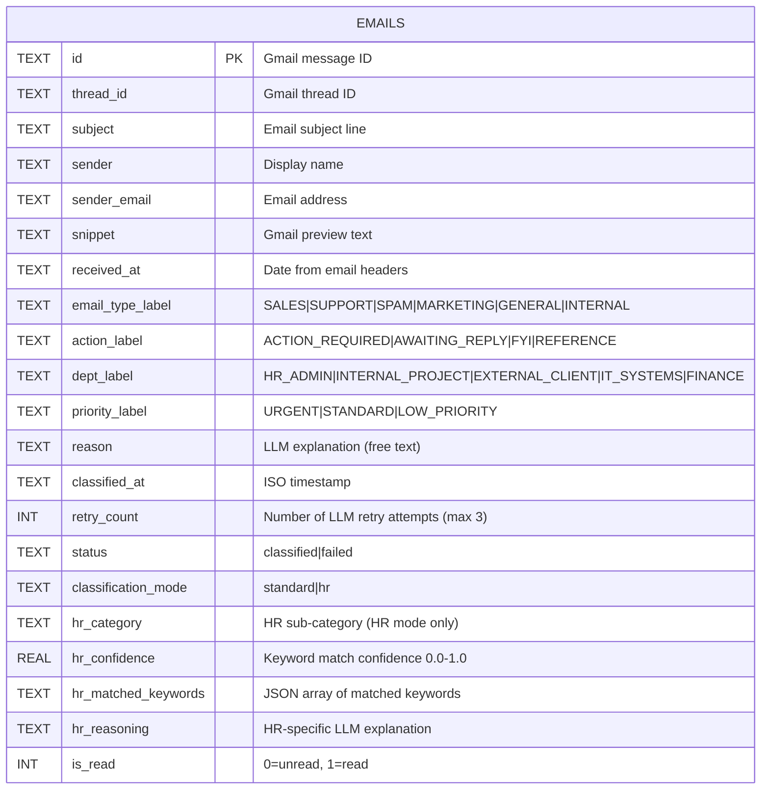

**Indexes:** `email_type_label`, `action_label`, `dept_label`, `priority_label`, `hr_category`, `classification_mode`, `is_read` — all indexed for O(log n) filter performance.

**Data Access Patterns:**

```sql
-- Load all for dashboard
SELECT * FROM emails ORDER BY received_at DESC;

-- Deduplication before new classification run  
SELECT id FROM emails;

-- Chart aggregation
SELECT email_type_label, COUNT(*) FROM emails GROUP BY email_type_label;

-- Unread count
SELECT COUNT(*) FROM emails WHERE is_read = 0;
```

---

## 🔒 Security Features

| Feature | Implementation | Detail |
|---|---|---|
| **Read-Only Access** | `gmail.readonly` OAuth2 scope | Cannot send, delete, or modify any email |
| **Local AI Inference** | Ollama on `localhost:11434` | Email content is NEVER sent to any external API |
| **Secure Credential Storage** | `~/.inbox-intel/` (outside repo) | OAuth tokens and credentials are gitignored |
| **Token Auto-Refresh** | `google-auth-oauthlib` | Refresh tokens are handled automatically |
| **JWT Authentication** | Pure-Python HS256 JWT | All frontend-to-backend API calls require Bearer tokens |
| **Account-Aware Retry** | `apiFetchWithAccountRetry()` | Automatic JWT refresh on 401 responses |
| **Token Encryption** | Optional Fernet encryption | OAuth tokens can be encrypted at rest |
| **HTTPS Support** | `generate_certs.sh` | Optional TLS for secure local development |
| **Rate Limiting** | 10-second cooldown on `/api/classify` | Prevents accidental rapid re-classification |
| **Local Database** | SQLite at `~/.inbox-intel/emails.db` | No cloud database; all data stays on device |
| **CORS Control** | FastAPI CORS middleware | Only `localhost:5173` is whitelisted by default |
| **Input Sanitization** | `_sanitize_text()` | Strips HTML, zero-width chars, and prompt injections |

---

## ⚡ Performance Notes

| Metric | Value | Notes |
|---|---|---|
| **API Response Time** (`/api/emails`) | ~50–200ms | Depends on DB size; full table scan |
| **Classification Speed** | ~3–8s per email | Depends on Ollama model and hardware |
| **Batch Processing** | ~200 emails | Configurable via `MAX_EMAILS_PER_RUN` |
| **React Filter/Sort** | <16ms | Client-side via `useMemo`, no DB query |
| **LLM Retry Budget** | 3 attempts | `CLASSIFICATION_RETRIES` in `.env` |
| **DB Size (1000 emails)** | ~2–5MB | SQLite; negligible storage footprint |
| **Stats Cache TTL** | 30 seconds | In-memory cache with auto-invalidation |

**Model Comparison:**

| Model | Speed | Accuracy | RAM Usage |
|---|---|---|---|
| `phi3:mini` | ⚡ Fast | ✅ Good | ~2–3GB |
| `llama3` | 🐢 Moderate | ✅ Better | ~4–6GB |
| `mistral` | ⚡ Fast | ✅ Good | ~4GB |

---

## 🧪 Testing

```bash
# Install test dependencies (if not already in requirements.txt)
pip install pytest pytest-cov

# Run all tests (68 tests)
pytest tests/ -v

# Run with coverage report
pytest tests/ --cov=. --cov-report=html
open htmlcov/index.html

# Run specific module tests
pytest tests/test_store.py -v
pytest tests/test_fetcher.py -v
pytest tests/test_graph.py -v
pytest tests/test_hr_keywords.py -v
```

---

## 🤝 Contributing

Contributions are very welcome! Inbox Intel follows standard GitHub flow.

### How to Contribute

```bash
# 1. Fork the repository on GitHub

# 2. Clone your fork
git clone https://github.com/YOUR_USERNAME/Email-Categoriser.git
cd Email-Categoriser

# 3. Create a feature branch
git checkout -b feature/your-amazing-feature

# 4. Set up the development environment
bash scripts/setup.sh
cd react-dashboard && npm install && cd ..

# 5. Make your changes and commit
git add .
git commit -m "feat: add amazing feature"

# 6. Push to your branch
git push origin feature/your-amazing-feature

# 7. Open a Pull Request on GitHub
```

### Commit Convention

We use [Conventional Commits](https://www.conventionalcommits.org/):

```
feat:     New feature
fix:      Bug fix
docs:     Documentation only
style:    Formatting, no logic change
refactor: Code restructure, no behavior change
test:     Adding or fixing tests
chore:    Dependency updates, config changes
```

### Code Style

- **Python**: Follow PEP 8; use `loguru` for all logging (no `print` statements)
- **JavaScript/React**: Functional components with hooks only; no class components
- **CSS**: Tailwind utility classes only; no custom CSS files except `index.css`

---

## ❓ FAQ

<details>
<summary><strong>Q: Does Inbox Intel ever send my emails to the cloud?</strong></summary>

**No.** All LLM inference runs on your local machine via [Ollama](https://ollama.com/). Your email content never leaves your device. The only outbound network calls are to the Gmail API (to fetch your emails) and to Google OAuth2 (for authentication).

</details>

<details>
<summary><strong>Q: Which LLM model should I use?</strong></summary>

For most setups, `phi3:mini` offers the best speed/accuracy balance and runs on ~3GB of RAM. If you have more RAM (8GB+), `llama3` produces better classification accuracy. You can switch models by changing `OLLAMA_MODEL` in your `.env` file or by using the model switcher in the dashboard UI.

</details>

<details>
<summary><strong>Q: Can I use a cloud LLM like OpenAI or Anthropic?</strong></summary>

Not out of the box — but it's possible. The classification call in `pipeline/nodes.py` can be replaced with any OpenAI-compatible client. See the Model Swap Strategy in `ARCHITECTURE.md`. Note: using a cloud LLM means your email content will leave your machine.

</details>

<details>
<summary><strong>Q: Can Inbox Intel delete or send emails on my behalf?</strong></summary>

**No.** The application uses the `gmail.readonly` OAuth2 scope, which is strictly read-only. It is architecturally impossible for the app to send, delete, or modify emails.

</details>

<details>
<summary><strong>Q: What happens if the LLM returns bad output?</strong></summary>

The pipeline retries up to 3 times (configurable via `CLASSIFICATION_RETRIES`). If all retries fail, the email is stored with fallback labels (`GENERAL`, `FYI`, `INTERNAL_PROJECT`, `STANDARD`) and `status = "failed"`. No emails are ever lost.

</details>

<details>
<summary><strong>Q: How do I change how many emails are processed per run?</strong></summary>

Set `MAX_EMAILS_PER_RUN` in your `.env` file. The default is `200`. Note that processing time scales linearly with this number.

</details>

---

## 🔧 Troubleshooting

<details>
<summary><strong>❌ Error: "Ollama connection refused"</strong></summary>

Ollama must be running before starting the application.

```bash
# Start Ollama
ollama serve

# Verify it's running
curl http://localhost:11434/api/version

# Check the model is available
ollama list
```

</details>

<details>
<summary><strong>❌ Error: "credentials.json not found"</strong></summary>

Download `credentials.json` from the Google Cloud Console (OAuth 2.0 Client → Download JSON) and place it at `~/.inbox-intel/credentials.json`.

```bash
mkdir -p ~/.inbox-intel
cp ~/Downloads/client_secret_*.json ~/.inbox-intel/credentials.json
```

</details>

<details>
<summary><strong>❌ React dashboard shows "Failed to fetch" error</strong></summary>

The FastAPI backend is not running or is on the wrong port.

```bash
# Start backend
source venv/bin/activate
uvicorn api.server:app --reload --port 8000

# Verify it's running
curl http://localhost:8000/api/health
# Expected: {"status":"ok"}
```

</details>

<details>
<summary><strong>❌ Classification is very slow</strong></summary>

This is normal for CPU inference. To speed up:
1. Switch to a smaller model: set `OLLAMA_MODEL=phi3:mini` in `.env`
2. If you have an NVIDIA GPU, ensure Ollama is using it: `ollama ps` should show your GPU
3. Reduce batch size: set `MAX_EMAILS_PER_RUN=50` for faster runs

</details>

<details>
<summary><strong>❌ "Module not found" errors on startup</strong></summary>

Ensure you have activated the virtual environment:

```bash
source venv/bin/activate   # macOS/Linux
venv\Scripts\activate      # Windows
```

If the issue persists, re-run setup:

```bash
bash scripts/setup.sh
```

</details>

<details>
<summary><strong>❌ OAuth token expired or invalid</strong></summary>

Delete the token file to force a fresh OAuth flow:

```bash
rm ~/.inbox-intel/token.json
python scripts/run.py  # Will re-trigger OAuth browser flow
```

</details>

---

## 📄 License

This project is licensed under the **MIT License** — see the [LICENSE](https://github.com/sagar-69/Email-Categoriser/blob/main/LICENSE) file for details.

```
MIT License

Copyright (c) 2026 Sagar

Permission is hereby granted, free of charge, to any person obtaining a copy
of this software and associated documentation files (the "Software"), to deal
in the Software without restriction...
```

---

## 🙏 Acknowledgements

Special thanks to the open-source projects that make Inbox Intel possible:

| Project | What It Provides |
|---|---|
| [**LangGraph**](https://github.com/langchain-ai/langgraph) | State-machine orchestration for the AI pipeline |
| [**Ollama**](https://ollama.com/) | Effortless local LLM inference |
| [**FastAPI**](https://fastapi.tiangolo.com/) | Blazing-fast Python API framework with auto-docs |
| [**React**](https://react.dev/) | Component-driven UI framework |
| [**Recharts**](https://recharts.org/) | Beautiful, composable React charts |
| [**Tailwind CSS**](https://tailwindcss.com/) | Utility-first CSS framework |
| [**Lucide React**](https://lucide.dev/) | Clean, consistent icon set |
| [**Google Gmail API**](https://developers.google.com/gmail/api) | Secure, programmatic Gmail access |

---

## 📬 Contact

<div align="center">

**Built with ❤️ by [sagar-69](https://github.com/sagar-69)**

[](https://github.com/sagar-69)
[](https://github.com/sagar-69/Email-Categoriser)

Found a bug? Have a feature idea?
**[Open an Issue →](https://github.com/sagar-69/Email-Categoriser/issues/new)**

</div>

---

## ⭐ Support

If Inbox Intel is useful to you, please consider:

- ⭐ **Starring the repo** — it helps others discover the project
- 🐛 **Reporting bugs** via [GitHub Issues](https://github.com/sagar-69/Email-Categoriser/issues)
- 🔀 **Contributing** — all PRs are welcome, big or small
- 📣 **Sharing** with others who care about email privacy

---

<div align="center">

### Star History

[](https://star-history.com/#sagar-69/Email-Categoriser&Date)

---

*Made with ❤️ — because your emails deserve privacy.*

</div>
